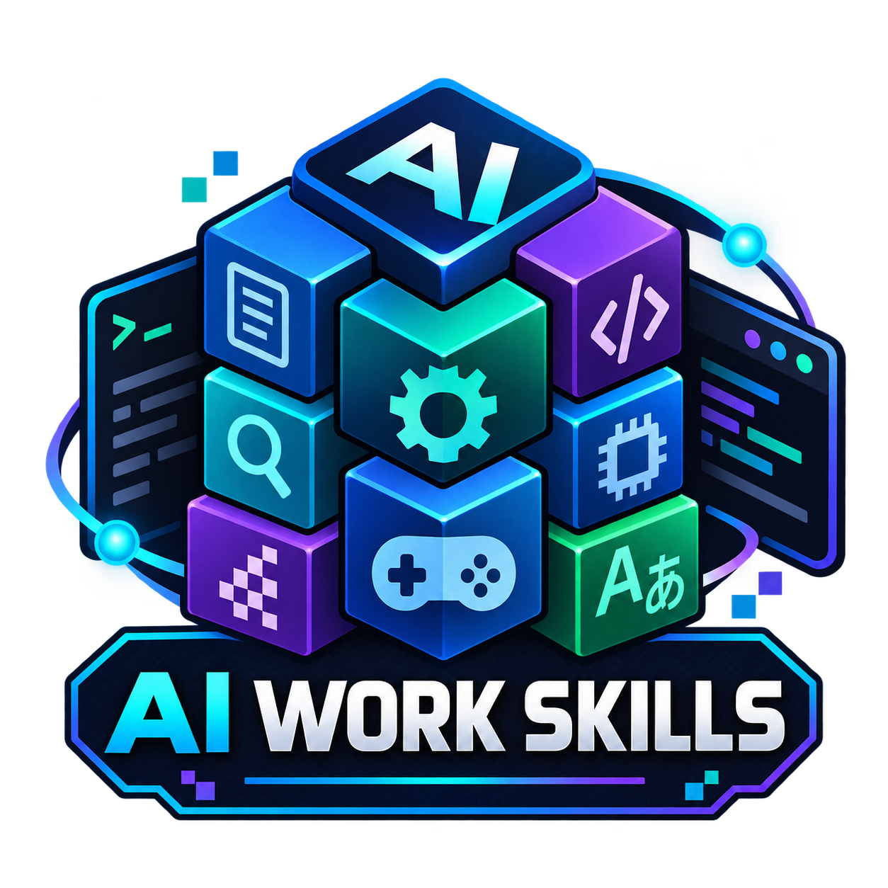

# ai-work-skills

<p align="center">
  
</p>

Codex 스킬을 다른 PC에서도 같은 버전으로 설치하는 개인용 저장소입니다.
**2026-09-14 갱신 완료: 기존 요청 15개와 AKM 워크플로 1개를 포함한 16개 스킬을 반영했습니다.**

**[최종 검토표·출처·기능 범위·검증 결과 보기 → REVIEW.md](REVIEW.md)**

외부 원본 5개는 검토한 커밋으로 다운로드합니다. 직접 제작한 8개와 Codex용으로 구성한 외부 스킬 3개는 `skills/`에 보관합니다.
공유된 Google 답변에 설치 원본이 없었던 항목은 직접 제작임을 명시했습니다.

## 다른 PC에서 설치

Git과 Python 3.10 이상을 준비합니다. 공개 저장소이므로 GitHub 로그인 없이 설치할 수 있습니다.

```powershell
git clone https://github.com/GimoXagros/ai-work-skills.git
cd ai-work-skills
python install.py
python setup_tools.py
```

macOS/Linux에서는 필요한 경우 `python` 대신 `python3`를 사용합니다.
GitHub에서 ZIP으로 받아 압축을 풀어도 두 Python 파일을 실행할 수 있습니다.
기본 스킬 설치에는 Python 표준 라이브러리와 인터넷 연결만 필요합니다.
`setup_tools.py`는 글리프 생성용 Pillow/fontTools를 저장소의 `.venv`에 설치합니다.
이후 글리프 생성 명령은 Windows의 `.venv/Scripts/python.exe`, macOS/Linux의 `.venv/bin/python`으로 실행합니다.
시스템 폰트나 게임 ROM은 포함하지 않으므로 실제 프로젝트에서 사용할 파일을 직접 지정합니다.

기본 스킬 설치 경로는 `$CODEX_HOME/skills`, 환경 변수가 없으면 `~/.codex/skills`입니다.
설치 후 다음 Codex 턴에서 확인하고, 목록이 갱신되지 않으면 새 작업을 열어 주세요.
이 PC의 `create-kr-patch`는 같은 커밋으로 설치된 기존 플러그인을 사용하며, 새 PC에서는 독립 스킬과 참조 문서를 설치합니다.

다른 검색 경로가 필요한 환경에서는 명시적으로 지정합니다. 같은 스킬을 여러 경로에 중복 설치하지 않는 편이 좋습니다.

```powershell
python install.py --dest "$env:USERPROFILE/.agents/skills"
```

## 사용 예

```text
$create-plan 이 기능 변경을 위한 구현·검증 계획을 세워 주세요.
$gba-pointer-fixer 이 GBA ROM의 포인터 테이블과 재배치 주소를 확인해 주세요.
$binary-re 이 바이너리의 형식과 구조를 정적으로 분석해 주세요.
$re 이 레트로 게임 ROM의 헥스 데이터와 뱅크별 주소 구조를 조사해 주세요.
$image-glyph-generator 선택한 폰트로 한글 글리프 아틀라스를 만들어 주세요.
$encoding-mapper 이 게임의 코드 테이블 충돌과 왕복 변환을 확인해 주세요.
$nftr-font-editor 이 NFTR의 구조와 글자폭을 검사해 주세요.
$ws-tile-compressor 원더스완 타일을 변환하고 같은 타일을 찾아 주세요.
$retro-font-allocator 장면별 한글 글리프 슬롯과 전체 저장 용량을 계산해 주세요.
$script-translator-limiter 이 대사를 번역하고 바이트·픽셀 제한을 검사해 주세요.
$akm-workflow 이 지식 저장소를 AKM 계층으로 분류하고 검증·Learn Back 절차를 설계해 주세요.
```

`akm-workflow`는 [DECK6/akm](https://github.com/DECK6/akm)의 Markdown 기반 지식 계층, 위험 기반 검증, Learn Back 및 보안 경계를 Codex용 실행 절차로 구성한 스킬입니다. AKM 저장소나 개인 지식 데이터를 자동 생성·수집하지 않으며, 기존 AKM 체크아웃의 규칙을 우선합니다. 장기 역공학 작업에서 증거와 실패 기록이 자연스럽게 이어지도록 `re`와 `binary-re`에도 AKM 호환 지침을 추가했습니다.

`create-plan`은 삭제된 실험 버전의 고정 다운로드 대신 저장소에 포함된 2.0 스킬을 사용합니다. 현재 작업공간과 실제 도구를 근거로 계획 깊이를 조절하고, 검증·위험·복구 지점을 명시하며, 사용자가 구현까지 요청하지 않은 경우 읽기 전용으로 끝납니다.

원래 요청한 `binary-parser`의 실제 배포 이름은 `binary-re`, `create-retro-game-kr-patch`는 `create-kr-patch`, 추가로 확인한 `hex-analyzer` 관련 원본은 `re`입니다.
설치기는 요청 이름도 별칭으로 받습니다. 스킬 호출은 실제 이름을 사용합니다.
각 도구의 입력 형식과 명령은 해당 `SKILL.md`에 있습니다.
`re`는 레트로 게임 역공학 절차와 기록 양식이며, 완성된 디스어셈블러·에뮬레이터나 Claude 전용 자동 실행 루프는 포함하지 않습니다.
앞서 제시된 Hex 데이터 분석 CLI는 여전히 설치 대상이 아닙니다. [추가 링크 검토 기록](REVIEW.md#hex-analyzer-추가-링크-검토)을 참고하세요.

## 재설치와 업데이트

```powershell
git pull --ff-only
python install.py
python setup_tools.py
```

- 설치기는 [skills-lock.json](skills-lock.json)의 검토된 커밋과 저장소에 포함된 스킬을 설치합니다. 임의의 upstream 최신 코드를 자동 적용하지 않습니다.
- 같은 파일은 건너뛰고, 다른 기존 폴더는 설치 경로 상위의 `skill-backups/<UTC 시각>/`에 보존합니다.
- `.system`, 기존 플러그인, 인증 파일, Codex 전체 설정은 복사하거나 변경하지 않습니다.
- `log-analyzer`는 원본에서 보관된 버전입니다. `create-plan`은 현재 Codex 방식에 맞춘 번들 2.0으로 교체했습니다. 나머지 외부 출처와 추가 실행 의존성은 [최종 검토표](REVIEW.md)에 기록했습니다.
- `.cache/`와 `.venv/`는 GitHub에 올리지 않습니다. 새 PC는 인터넷으로 원본과 Python 패키지를 다운로드합니다.
- 캐시가 준비된 PC의 오프라인 재설치: `python install.py --offline`
- 목록 확인: `python install.py --list`
- 선택 설치: `python install.py --skill script-translator-limiter` — 필요한 `encoding-mapper`도 함께 설치합니다.

## 검증

원본 다운로드 캐시와 글리프 도구 환경을 준비한 뒤 실행합니다.

```powershell
python install.py
python setup_tools.py
.\.venv\Scripts\python.exe -X utf8 -m unittest discover -s tests -v
```

macOS/Linux의 검사 명령은 `.venv/bin/python -m unittest discover -s tests -v`입니다.
자동 검사 29개는 합성 데이터와 16개 스킬의 설치 동작을 검증합니다. 실제 게임 호환성이나 외부 런타임 전체를 검증한 결과는 아닙니다.

## 라이선스와 원본 보존

다운로드하는 각 스킬은 각 원본의 라이선스·이용 조건을 따릅니다. 다운로드 전용 6개 원본은 이 저장소에서 재배포하지 않습니다.
`skills/binary-re`는 MIT 조건에 따라 원 저작권과 LICENSE를 보존한 수정 배포본입니다.
`skills/re`도 vgrichina/re-skill의 MIT 라이선스를 보존한 Codex용 수정 배포본입니다.
`vendor/skill-installer`의 설치 도우미는 이 PC의 OpenAI 시스템 skill-installer에서 가져왔고, Apache-2.0 `LICENSE.txt`를 보존했습니다. 해당 도우미의 코드는 수정하지 않았습니다.
직접 제작 스킬을 OpenAI나 mcpads의 공식 스킬로 표시하지 않습니다.
